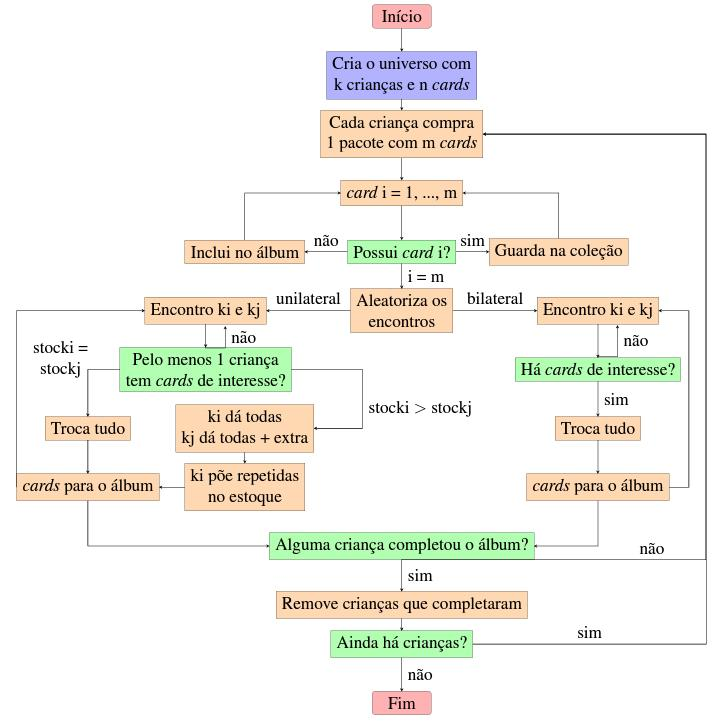

# RBras-2018

============

Hello!

Welcome to my project presented on the 63rd RBras, held in Curitiba, Brazil.

This project involves a practical example of S4 class methodology. It is destined mainly to people who are learning the S4 methodology and need a practical example. To access the examples, simply open the folder regarding the language of your preference and download the .R file available.  

You can find below the flow chart related to the simulation. Feel free to analyse it!

(Sorry if it's in portuguese! English version soon.)

============

Olá!

Seja bem-vindo ao meu projeto apresentado no 63º RBras, realizado em Curitiba.

Este projeto envolve um exemplo prático de metodologia S4. Ele é destinado principalmente a quem está aprendendo a metodologia S4 e precisa de um pouco de ajuda prática. Para acessar os exemplos, simplesmente abra a pasta referente ao idioma de sua preferência e faça o download do arquivo .R disponível.

Você pode encontrar acima o fluxograma da simulação. Sinta-se à vontade para analisá-lo!